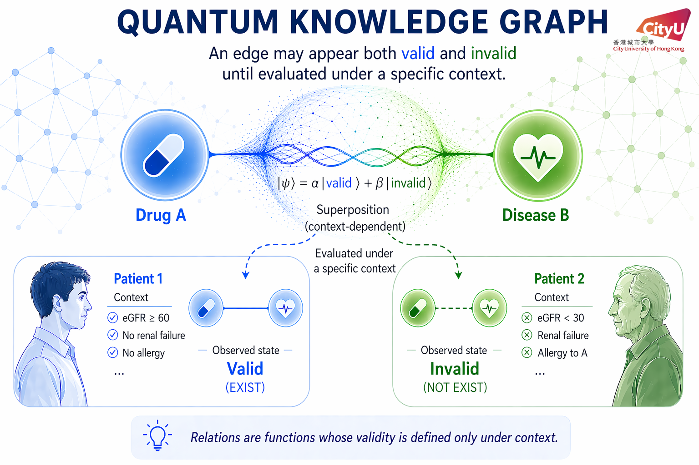

# Quantum Knowledge Graph (QKG): Modeling Context-Dependent Triplet Validity

Code and analysis artefacts for the paper *Quantum Knowledge Graph: Modeling
Context-Dependent Triplet Validity*. This repository reproduces the
reasoner–validator pipeline and the statistical analyses reported in the
paper.

Paper link: https://arxiv.org/pdf/2604.23972

## QKG at a glance

Standard knowledge graphs treat each triplet as globally valid. In many
settings, whether a relation should count as evidence depends on context.
QKG replaces the binary truth of a triplet with a triplet-specific function
of context \(F_{\tau}(C)\); in medicine this is instantiated by augmenting
KG relations with natural-language applicability conditions
(`AVOID` / `RECOMMENDED` / `CAUTION` ConstraintItem annotations) and using
them in a reasoner–validator loop.



On the paper's N = 2,788 MedReason evaluation set, QKG-backed validation
improves over both the no-validator baseline and KG validation without
context matching. Full per-sample correctness, paired significance tests,
and leakage classifications are under [paper/data_result/](paper/data_result/)
and [paper/figures/](paper/figures/).

## Datasets

The paper-scale artefacts are hosted on HuggingFace and upstream sources.

### Published on HuggingFace

1. `qkg-primekg-entities-with-cui` —
   <https://huggingface.co/datasets/HKAI-Sci/qkg-primekg-entities-with-cui>
   - unique PrimeKG entities annotated with UMLS CUI. Loaded into
     `primeKG.entities`.
2. `qkg-relation-with-facts` —
   <https://huggingface.co/datasets/HKAI-Sci/qkg-relation-with-facts>
   - patient-group-specific `ConstraintItem` annotations (68,651 facts over
     the four applicability-sensitive relation types described in
     Section 3.1). Loaded into `primeKG.relation_with_facts`.
3. `qkg_qa_dataset` —
   <https://huggingface.co/datasets/HKAI-Sci/qkg_qa_dataset>
   - the curated N = 2,788 KG-grounded MedReason evaluation set consumed
     by `conditionKgTestAgentic.py`.

### Upstream dependencies

4. `PrimeKg.csv` — from the official PrimeKG release. Loaded into
   `primeKG.relations`.
5. UMLS `MRCONSO.RRF` — from the official UMLS release. Loaded into
   `umls_test.umls_strings_raw_test`.

### Required Mongo collections

| Database  | Collection                  | Source                          |
|-----------|-----------------------------|---------------------------------|
| `primeKG` | `relations`                 | upstream `PrimeKg.csv`          |
| `primeKG` | `entities`                  | `qkg-primekg-entities-with-cui` |
| `primeKG` | `relation_with_facts`       | `qkg-relation-with-facts`       |
| `umls_test` | `umls_strings_raw_test`   | upstream `MRCONSO.RRF`          |

Field summaries: [docs/resource-mongo.md](docs/resource-mongo.md).

## Quickstart

### 1. Environment

Python 3.11. Either **conda** works.

**conda**

```bash
conda create -n qkg python=3.11 -y
conda activate qkg
pip install -r requirements.txt
```


### 2. Config

```bash
cp conf/config.example.yaml conf/config.yaml
```

Edit `conf/config.yaml` with your MongoDB URIs, artefact file paths, and
your LLM backends. The three LLM roles are:

- `reasoner` — called as the pure-LLM Reasoner in Algorithm 1.
- `validator` — called inside the KG-grounded Validator loop.
- `patient-context-llm` — used *only* by the offline leakage-classification
  re-label passes (`classify_unclassified_*_with_llm.py`) for Appendix A.3.
  It is not used by `conditionKgTestAgentic.py`, so the main pipeline can run
  without configuring this role. If you do want the re-label scripts, it can
  point at the same backend as `validator`.

Each role can use an OpenRouter / OpenAI-compatible chat API or AWS
Bedrock — see `conf/config.example.yaml`.

Minimum paths block:

```yaml
mongo:
  primekg_uri: mongodb://localhost:27017/primeKG
  umls_uri:    mongodb://localhost:27017/umls_test

paths:
  primekg_csv:               /absolute/path/to/PrimeKg.csv
  umls_mrconso_rrf:          /absolute/path/to/MRCONSO.RRF
  primekg_entities_jsonl:    /absolute/path/to/qkg-primekg-entities-with-cui.jsonl
  relation_with_facts_jsonl: /absolute/path/to/relation_facts_all_cleaned_no_refs.jsonl
  qa_eval_jsonl:             /absolute/path/to/top_samples_filtered.jsonl
```

### 3. Load data into MongoDB

For the `mongoimport` command, export your PrimeKG Mongo URI first:

```bash
export QKG_PRIMEKG_MONGO_URI="mongodb://localhost:27017/primeKG"
```

Published artefacts:

```bash
mongoimport --uri "$QKG_PRIMEKG_MONGO_URI" --db primeKG --collection entities \
    --file /path/to/qkg-primekg-entities-with-cui.jsonl
python tools/import_relation_facts.py
```

Upstream dependencies:

```bash
python tools/import_primekg_relations.py
python tools/import_umls_strings.py
```

These read from `paths.primekg_csv`, `paths.umls_mrconso_rrf`,
`mongo.primekg_uri`, `mongo.umls_uri`.

## Run evaluation

Main entrypoint:

```bash
python conditionKgTestAgentic.py                         # full set, no patient context
python conditionKgTestAgentic.py --patient-context       # full set, with QKG context matching
python conditionKgTestAgentic.py --run medqa_839         # single sample, verbose
python conditionKgTestAgentic.py --run qa_4055 --patient-context
```

Input is read from `paths.qa_eval_jsonl`. Output goes to the path given by
`--output /path/to/results.jsonl`; if omitted, the script writes to an
auto-named file under `output/`.

### Output format

One JSON object per line. Typical fields:

- `sample_key`, `gold_answer` — stable id and MCQ gold.
- `agentic_answer`, `agentic_correct`, `agentic_reasoning` — final answer
  after the Reasoner-Validator loop.
- `num_turns`, `num_tool_calls`, `tool_calls`, `conversation` — trace of
  the ReAct loop.
- `llm_stats`, `elapsed_s` — LLM usage and wall-clock.
- With `--patient-context`: `patient_context`, `hook_log`,
  `compression_log`.
- For the leakage classifier to run on an output log, the record should
  also include `reasoner_answer`, `reasoner_correct`, `final_answer`,
  `final_correct`, and `validation_report` (the per-claim
  `{option, claim, supports, status, evidence}` list emitted by the
  Validator).

Example:

```json
{
  "sample_key": "qa_4055",
  "gold_answer": "D",
  "agentic_answer": "D",
  "agentic_correct": true,
  "agentic_reasoning": "...",
  "num_turns": 11,
  "num_tool_calls": 10,
  "patient_context": "...",
  "llm_stats": {"calls": 22, "wait_s": 0.0, "llm_s": 276.4},
  "elapsed_s": 320.8
}
```

## Reproduce the paper

All of the scripts below read from your own validator-run JSONL logs. The
numbers in `paper/data_result/significance_results.csv`,
`paper/figures/leakage_classification_*.csv`, and in the paper itself are
the committed reference.

### Paired McNemar tests (Figure 2, Figure 3, Table 2)

```bash
# 1) dump per-sample correctness from your four validator-run JSONL logs
#    into paper/data_result/per_sample/{haiku_wpc,haiku_nopc,qwen_wpc,qwen_nopc}.csv
#    (see paper/data_result/per_sample/README.md for the one-liner)

# 2) produce paired joins + the significance summary
python paper/data_result/significance_tests.py
```

Outputs: `paper/data_result/significance_results.csv`, plus the three
`paired_*.csv` files under `paper/data_result/per_sample/`.

### Leakage classification (Table 2 and Table 3, Section 5.3 and Appendix A.3)

Two-pass classifier. The regex pass runs locally; the LLM re-label pass
needs AWS credentials and the `f1` package (see the optional
`patient-context-llm` role in `conf/config.yaml`). This role is only for the
Appendix A.3 re-label scripts, not for the main pipeline.

```bash
# regex pass on W->C revisions
python paper/figures/classify_leakage.py \
    --no-pc /path/to/qwen_nopc.jsonl \
    --with-pc /path/to/qwen_wpc.jsonl

# regex pass on C->W regressions
python paper/figures/classify_leakage_c2w.py \
    --no-pc /path/to/qwen_nopc.jsonl \
    --with-pc /path/to/qwen_wpc.jsonl

# LLM re-label pass for the residual UNCLASSIFIED cases (29+27 W->C, 3+3 C->W)
export QKG_NO_PC_LOG=/path/to/qwen_nopc.jsonl
export QKG_WITH_PC_LOG=/path/to/qwen_wpc.jsonl
python classify_unclassified_with_llm.py
python classify_unclassified_c2w_with_llm.py
```

Outputs live under `paper/figures/`:

- `leakage_classification_{summary,per_case}.csv` — regex-only output.
- `leakage_classification_{summary,per_case}_llm.csv` — merged regex+LLM,
  the final W->C numbers used in Tables 2 and 3.
- `leakage_classification_c2w_{summary,per_case}.csv` — the final C->W
  numbers used in Table 3.

### Figures

```bash
python paper/figures/generate_main_patient_results_plot.py
python paper/figures/generate_qwen_validator_results_plot.py
python paper/figures/generate_case_studies.py
python paper/figures/combine_case_studies.py
```

Figure 1 is rendered via Chrome; see
[paper/figures/README.md](paper/figures/README.md) for the command line.

## Citation

Paper: [*Quantum Knowledge Graph: Modeling Context-Dependent Triplet Validity*](https://arxiv.org/pdf/2604.23972).

```bibtex
@misc{wang2026quantumknowledgegraph,
  title={Quantum Knowledge Graph: Modeling Context-Dependent Triplet Validity},
  author={Wang, Yao and Geng, Zixu and Yan, Jun},
  year={2026},
  eprint={2604.23972},
  archivePrefix={arXiv},
  url={https://arxiv.org/abs/2604.23972}
}
```

## License

See the upstream repository for license terms; datasets linked on
HuggingFace carry their own license (PrimeKG under the original PrimeKG
license; UMLS is subject to the UMLS Metathesaurus License).
